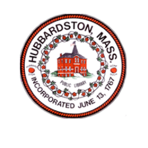

<!DOCTYPE html>
<html lang="en">
<head>
    <meta charset="UTF-8">
    <meta name="viewport" content="width=device-width, initial-scale=1.0">
    <title>Hubbardston Budget Portal</title>
    
    <!-- Google Fonts -->
    <link href="https://fonts.googleapis.com/css2?family=Inter:wght@300;400;600&display=swap" rel="stylesheet">

    
</head>
<body>

    <!-- Header Section -->
    <header>
        
        <h1>FY26 Hubbardston Budget Portal</h1>
    </header>

    <!-- Navigation Bar -->
    <nav>
        <a href="index.html">🏠 Home</a>
        <a href="revenue.html">💰 Revenue</a>
        <a href="expenditures.html">💸 Expenditures</a>
        <a href="dashboard/index.html">📊 Dashboard</a>
    </nav>

    <!-- Main Content -->
    

        <h2>Welcome to Hubbardston's Budget Portal</h2>
        
A <strong>modern, interactive platform</strong> designed to enhance <strong>financial transparency</strong> and <strong>community engagement</strong> in Hubbardston.

        

            <a href="revenue.html" class="btn">💰 View Revenue Details</a>
            <a href="expenditures.html" class="btn">💸 View Expenditures</a>
            <a href="dashboard/index.html" class="btn">📊 Explore Budget Dashboard</a>
        

    

    <!-- Footer -->
    <footer>
        &copy; 2025 Town of Hubbardston | All Rights Reserved
    </footer>

</body>
</html>
