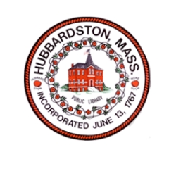

<!DOCTYPE html>
<html lang="en">
<head>
    <meta charset="UTF-8">
    <meta name="viewport" content="width=device-width, initial-scale=1.0">
    <title>Hubbardston Budget</title>
    <link rel="stylesheet" href="style.css">
</head>
<body>
    

    

    

        <a href="index.html">🏠 Home</a>
        <a href="revenue.html">💰 Revenue</a>
        <a href="expenditures.html">💸 Expenditures</a>
        <a href="dashboard/index.html">📊 Dashboard</a>
    

    

        <h1>Welcome to the Interactive Budget</h1>
        
This website is designed to make the Town of Hubbardston's budget process transparent and accessible to residents.

        <h2>📂 Quick Links</h2>
        <ul>
            <li><a href="revenue.html">View Revenue Details</a></li>
            <li><a href="expenditures.html">View Expenditures</a></li>
            <li><a href="dashboard/index.html">Explore Budget Dashboard</a></li>
        </ul>
    

    

        &copy; 2025 Town of Hubbardston | All Rights Reserved
    

</body>
</html>
